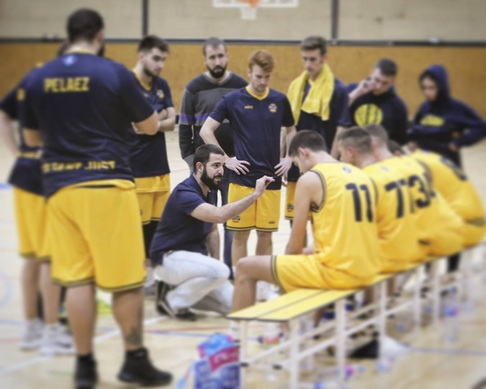
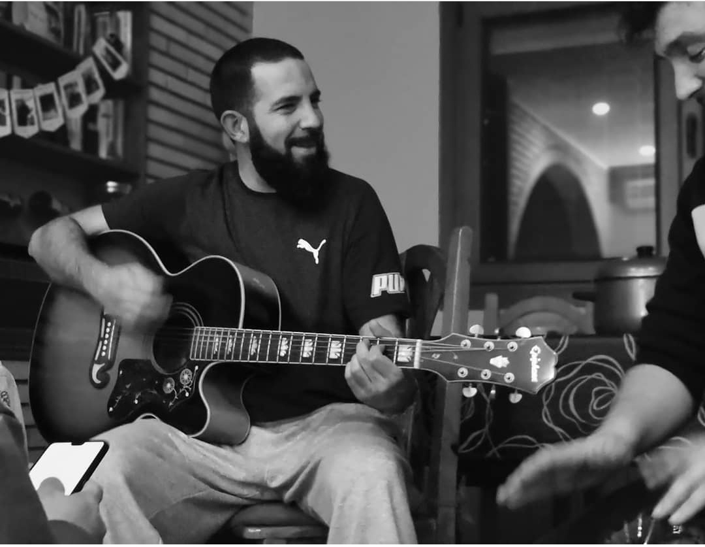

<h1 align="left">Hola 👋, soy Quique Supertramp</h1>

- ✨ Soy autodidacta, responsable, detallista y leal. Y dicen que cabezón, aunque se refieren a mi perseverancia. 😄
- 🌱 En constante crecimiento. Me gusta estar al día de los avances y las novedades, una de las razones por las que me encanta este sector.
- ⚡ Puedes ver mi portfolio en [https://quiquesupertramp.github.io/portfolio/](https://quiquesupertramp.github.io/portfolio/)

<h3 align="left">Tecnologías:</h3>

 
   
  
  
   
   
  
  
   
  
   
   
   
   
   

   
<h3 align="left">Contacta conmigo en:</h3>

   
<h3 align="left">Hobbies:</h3>

